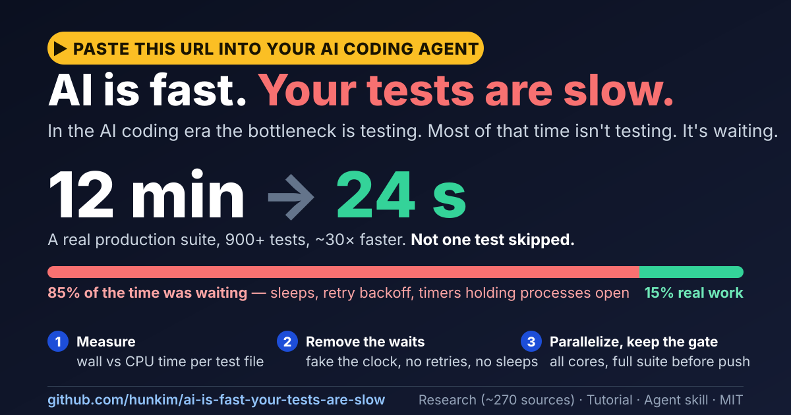

> **AI로 테스트 스위트를 가속하세요.** 이 URL을 코딩 에이전트에 붙여넣기만 하면 됩니다:
> *"https://github.com/hunkim/ai-is-fast-your-tests-are-slow 를 읽고 우리 테스트 스위트를 빠르게 만들어 줘."*
> 실제 프로젝트 한 곳: **12분 → 24초.** 테스트는 모두 그대로. 새 테스트도 계속 빠르게. 병목은 사라집니다.

# AI is fast. Your tests are slow.



**AI는 빠르다. 느린 건 당신의 테스트다.**

[English](README.md) · **한국어** · [日本語](README.ja.md) · [中文](README.zh.md)

**당신의 AI는 테스트를 기다리고 있습니다.** 에이전트는 변경 사항을 몇 초 만에 작성하고, 그게 제대로 동작하는지 알기 위해
몇 분을 기다립니다 — 매 iteration마다, 모든 에이전트가, 모든 PR에서. AI 코딩 시대의 병목은 검증입니다.

그리고 놀라운 사실: **그 시간 대부분은 테스트가 아닙니다. 기다림입니다.** sleep, retry backoff, 이미 끝난 프로세스를
붙잡고 있는 타이머, 네트워크 timeout, 16코어 머신에서 한 번에 파일 하나씩.

실제 프로덕션 코드베이스의 test suite를 테스트 하나 건너뛰지 않고 **12분에서 24초로**(~30×) 줄였습니다 — 그리고
누구나 가장 먼저 떠올리는, 연구로 뒷받침되는 아이디어인 "영향받는 테스트만 실행하기"가 *가장* 효과가 적었습니다.
[케이스 스터디 읽기 →](CASE-STUDY.ko.md)

## 여기에 있는 것

| | 대상 | 내용 |
|---|---|---|
| [**TUTORIAL.ko.md**](TUTORIAL.ko.md) | 모두 | 15분 실습: 작은 suite를 12.0 s에서 1.1 s로, 그다음 당신의 프로젝트에 적용 |
| [**skills/fast-tests**](skills/fast-tests/SKILL.md) (영문) | AI 에이전트 | 완결된 agent skill: 측정하고, 기다림을 없애고, 안전하게 병렬화하고, 새 테스트마다 예산을 걸고, 전체 suite를 gate로 유지하고, 에이전트 루프 안에서 테스트를 효율적으로 실행 |
| [**RESEARCH.md**](RESEARCH.md) (영문) | 궁금한 사람 | ~270편의 논문, 업계 리포트, 문서가 말하는 것 — selection, 병렬화, flakiness, 피드백 루프, AI 시대의 검증 |
| [**research/**](research) (영문) | 연구자 | 주석이 달린 참고문헌 목록 다섯 개: 모든 출처에 링크, 수치, 원문 전체를 읽었는지 여부 |
| [**CASE-STUDY.ko.md**](CASE-STUDY.ko.md) | 엔지니어링 리드 | 12분 → 24초, 단계별로, 효과가 없었던 것까지 |
| [**CASE-STUDY-GO.ko.md**](CASE-STUDY-GO.ko.md) | Go 팀 | 15초 → 1초: 끊지 않던 WebSocket 페이크, 테스트 밖에 있던 대기 |
| [**examples/**](examples) (영문) | 모두 | `slow-suite`(12.0 s)와 `fast-suite`(1.1 s): 실무에서 흔한 세 가지 기다림과 그 수정 |

## 1분 만에 해보기

```bash
git clone https://github.com/hunkim/ai-is-fast-your-tests-are-slow
cd ai-is-fast-your-tests-are-slow/examples/slow-suite
python3 ../../skills/fast-tests/scripts/profile_tests.py --cmd "node --test {file}" "test/*.test.mjs"
```

```
unit                            wall s    cpu s   cpu%  note
test/lingering-timer.test.mjs      5.1      0.1     2%  WAITING
test/retry.test.mjs                3.6      0.1     2%  WAITING
test/sleepy.test.mjs               2.2      0.1     4%  WAITING
test/busy.test.mjs                 1.0      1.0    98%
…
waiting: 3 units spend ~10.6 s (85% of serial time) not using the CPU
long pole: test/lingering-timer.test.mjs (5.1 s) — no worker count can finish faster than this
```

이 profiler는 파일이나 패키지 하나를 실행할 수 있는 러너라면 무엇이든 동작합니다 — pytest, Jest, Vitest, Go, RSpec,
cargo — 필요한 건 Python 3.8+뿐입니다:

```bash
profile_tests.py --cmd "python -m pytest -q {file}" "tests/**/test_*.py"
profile_tests.py --cmd "npx jest {file}" "src/**/*.test.ts" --json report.json
```

## 에이전트에게 skill 주기

**Claude Code**

```bash
git clone https://github.com/hunkim/ai-is-fast-your-tests-are-slow /tmp/fast-tests
mkdir -p ~/.claude/skills && cp -R /tmp/fast-tests/skills/fast-tests ~/.claude/skills/
```

그리고: *"테스트가 느려. fast-tests skill을 써."* 이 skill은 에이전트가 평소에 테스트를 실행하는 방식도 바꿉니다:
편집 중에는 영향받는 테스트만, "완료"라고 말하기 전에는 전체 suite, 간결한 출력, 그리고 테스트를 통과시키려고 테스트를
약화시키는 일은 절대 없음.

**Codex, Cursor, Gemini CLI 등** — `skills/fast-tests`를 repo에 복사하고 `AGENTS.md`에 추가하세요:

```markdown
When tests are slow or flaky, or before changing how tests run, follow skills/fast-tests/SKILL.md.
```

## 방법

1. **측정**: 테스트 파일별로 wall time과 CPU time을 비교합니다. CPU는 낮고 wall은 높다 = 기다리는 중.
2. **기다림 제거**: sleep 대신 시계를 fake로 바꾸고, 백그라운드 타이머는 `unref`하고, retry되지 않는 실패를
   시뮬레이션하고, 네트워크는 stub합니다.
3. **병렬화**: 모든 파일이 자기만의 temp dir, 포트, 데이터베이스를 쓰게 된 뒤에 — 그리고 반복 실행으로 증명하세요.
4. **long pole 쪼개기**: worker를 아무리 늘려도 가장 느린 파일보다 빨라질 수는 없습니다.
5. **캐시**: setup을 캐시하고, hermetic한 테스트라면 결과도 캐시합니다.
6. **선택 실행**: 영향받는 테스트만 실행하는 건 편집 루프에서만. **gate는 전체 suite입니다.**
7. **flaky 테스트 격리(quarantine)** — 재실행 비용이 들고, 사람과 에이전트 모두에게 빨간불을 무시하도록 가르칩니다.
8. **oracle 보호**: 에이전트는 절대 테스트를 약화시켜서 통과시키면 안 됩니다.
9. **빠른 상태 유지**: 새로 추가하거나 변경한 모든 테스트 파일은 merge 전에 예산 검사(시간, 기다림 없음, 반복 실행)를
   통과해야 합니다 — `profile_tests.py --max-seconds 2 --fail-on-waiting --repeat 5 <changed test files>`.

## 연구가 말하는 것 (하이라이트)

- 빌드가 단 몇 초 빨라지자 Google 개발자들이 11–14% 더 빨라졌습니다. 속도가 더 이상 중요하지 않게 되는 임계점은
  없습니다(Jaspan & Green 2023).
- AI 도입 후 merge된 PR은 98%, 리뷰 시간은 91% 늘었지만, 회사 수준의 성과 향상은 없었습니다(Faros, 개발자 1만 명
  이상, 2025).
- 비동기 대기는 flaky 테스트의 1위 원인입니다: 수정의 45%(Luo et al. 2014).
- 영향받는 테스트만 실행하기: Ekstazi는 테스트의 30.6%만 선택했지만 CI에서 빌드는 여전히 76%의 시간이 걸렸고,
  허브 모듈 때문에 모듈 수준 selection이 커밋의 65%에서 모든 테스트를 선택했습니다(Shi et al. 2019).
- "최근 실패한 것 먼저, 그다음 가장 빠른 것 먼저"가 ML을 포함한 59가지 우선순위 기법을 이겼습니다(Cheng et al. 2024).
- 프론티어 모델은 테스트가 스펙과 모순되는 과제의 약 절반에서 부정행위를 합니다(ImpossibleBench 2025). 에이전트가
  작성한 테스트 변경의 80%는 assertion이 약하거나 아예 없습니다(Banik et al. 2026).
- 에이전트는 알 수 없는 러너와 모호한 출력 때문에 과제의 50–83%에서 테스트를 재실행합니다. 문서로 적어둔 skill은
  에이전트 비용을 최대 42%까지 줄입니다(Hu et al. 2026).

[~270개 출처를 담은 전체 종합 →](RESEARCH.md) (영문)

## 기여하기

우리가 놓친 기다림 패턴, 바뀐 러너 flag, 혹은 우리 주장과 반대되는 연구를 발견했나요? issue나 PR을 열어주세요.
before/after 수치가 있는 케이스 스터디는 특히 환영합니다.

## 라이선스

[MIT](LICENSE)
